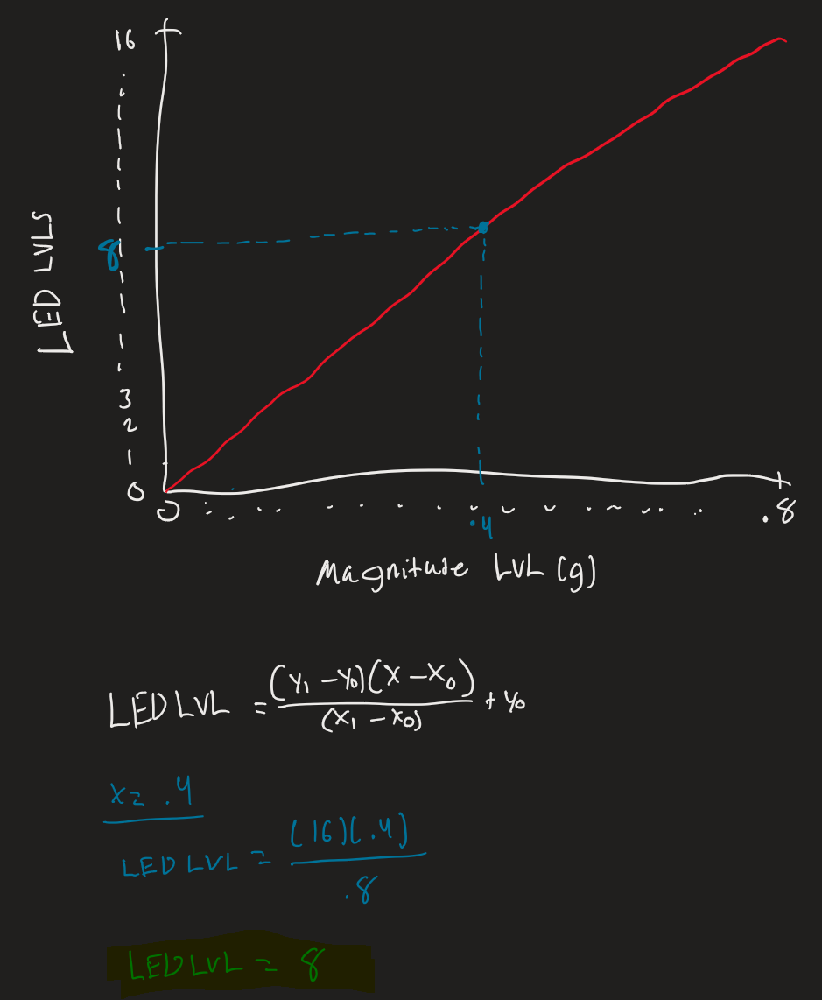

# Lab 10 Tapping Detection

## Overview

The accelerometer we are using has 8-bit registers for each of the x, y, and z coordinates. The values inside are represented as COUNTS, which is essentially the value of acceleration measured by the ADC. Knowing the 3 components of acceleration in Cartesian coordinates (x, y, and z) we can use the magnitude equation to determine the magnitude of acceleration. 

Please refer to the following PDF file for detailed instructions and description of the lab:
- [Lab Instructions](Lab_10_Tapping_Detection/images/Lab%2010%20-%20Tapping%20Detection.pdf)

## Magnitude Levels vs LED Levels Graph + Equation for Y

While idle, the magnitude of acceleration will be a value close to 1g because of the gravitational force of earth. When tapping, the magnitude will change from this value by a lot of little depending on how hard the tap is, but it's not a consistent, laid out value that shows a level from 0 to X. The vibrations from tapping can cause the magnitude to go above or below the idle 1g, which is hard to put onto a graph to map magnitude against LED levels.

Thus, the magnitude levels within the graph is represented as the following.

**Magnitude Levels = | Calculated Magnitude - 1g |**

This allows the magnitude to represented as levels where the higher it is then that means the tapping intensity is strong and this allows us to map magnitude to LEDs

## Video Demo

