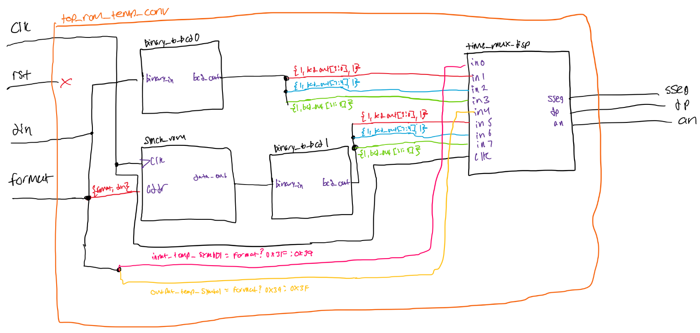

# Lab 4 ROM Based Temperature Conversion

## Overview

Please refer to the following PDF file for detailed instructions and description of the lab:
- [Lab Instructions](images/Lab%204%20-%20ROM%20Based%20Temperature%20Conversion.pdf)

## Circuit Schematic

## BRAM Utilization 
| Site Type              | Used | Fixed | Prohibited | Available | Util% |
|------------------------|------|-------|------------|-----------|-------|
| Block RAM Tile         | 0.5  | 0     | 0          | 135       | 0.37  |
| RAMB36/FIFO*           | 0    | 0     | 0          | 135       | 0.00  |
| RAMB18                 | 1    | 0     | 0          | 270       | 0.37  |
|   RAMB18E1 only        | 1    | N/A   | N/A        | N/A       | N/A   |

