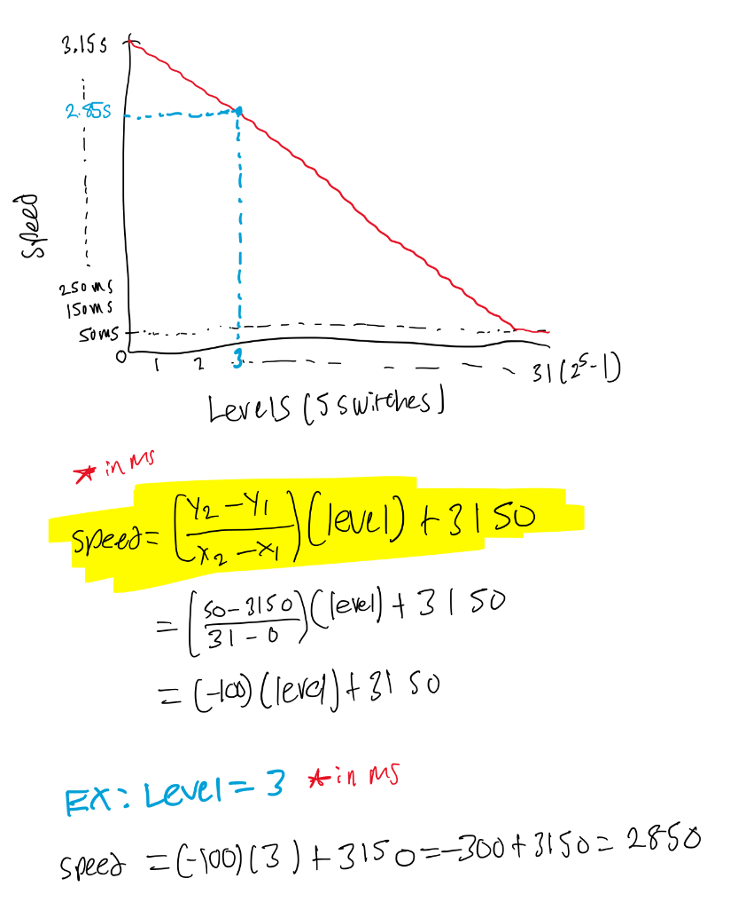

# Lab 6 Chasing LEDS

## Overview

Please refer to the following PDF file for detailed instructions and description of the lab:
- [Lab Instructions](Lab%206%20-%20Chasing%20LEDs.pdf)

## Speed vs Levels Graph + Equation for Y

We are using 5 switches to control the speed levels, therefore there are 2^5 = 32 levels. For speed, I put the max at 50ms so that the change from one LED to the next at the very maximum is still visible to the human eye. Additionally, the speed changes 100ms between each level (i.e. slope is -100ms) so the initial value (when level = 0) is the y-intercept. 

## Video Demo
