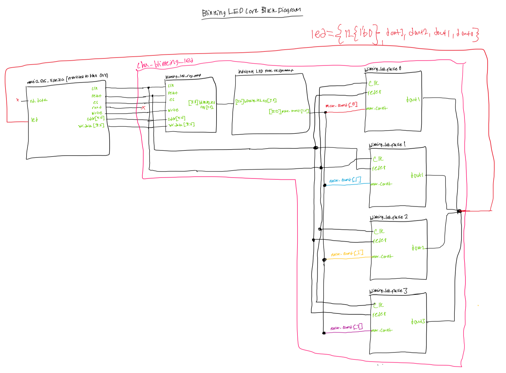
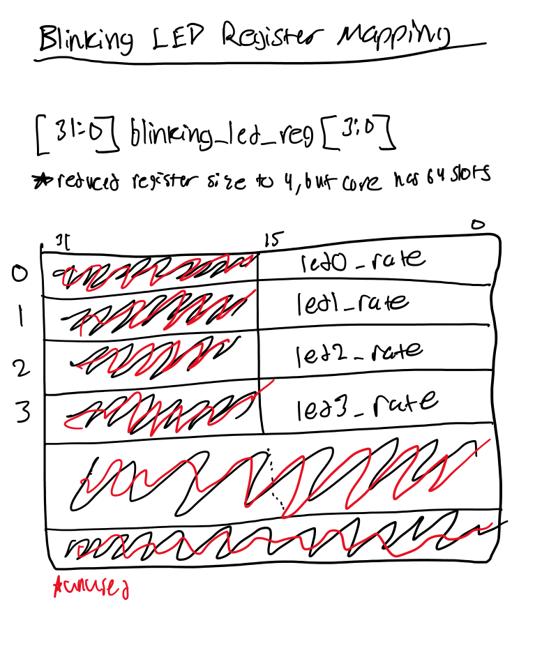
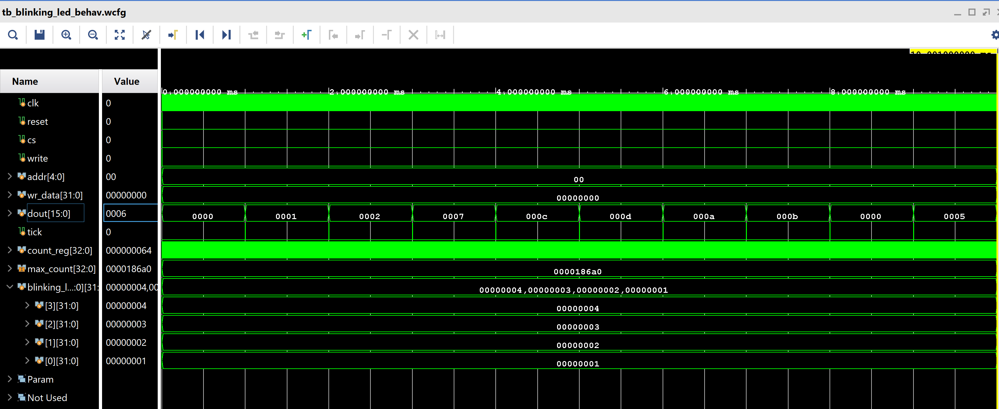

# Lab 7 Blinking LEDs Core

## Overview

Please refer to the following PDF file for detailed instructions and description of the lab:
- [Lab Instructions](Lab_7_Blinking_LEDS_Core/images/Lab%207%20-%20Blinking%20LEDs%20Core.pdf)

##  Schematic

##  Core Register Mapping

## Simulation Waveform

The data in blinking_led_reg is interpreted as miliseconds, so the values in each register are in miliseconds and then are later converted to nanoseconds because our FPGA runs at a 100MHz clock frequency 

