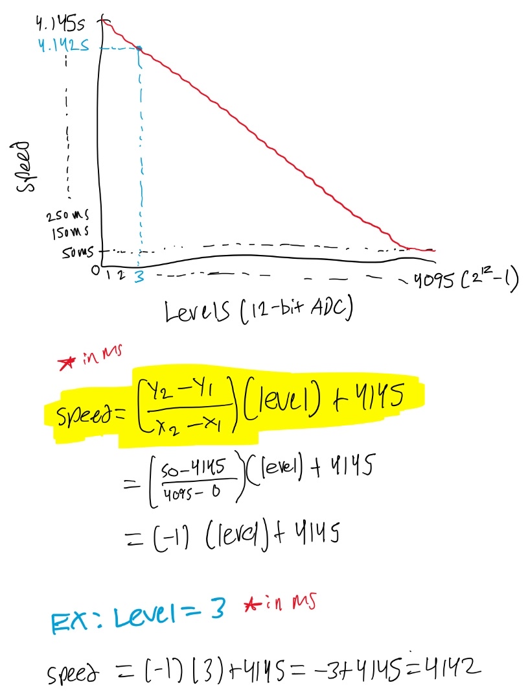

# Lab 8 Potentiometer-Controlled Chasing LEDS

## Overview

Please refer to the following PDF file for detailed instructions and description of the lab:
- [Lab Instructions](Lab_8_Potentiometer_Controlled_Chasing_LEDS/images/Lab%208%20-%20Potentiometer-Controlled%20Chasing%20LEDs%20.pdf)

## Speed vs Levels Graph + Equation for Y

We are using 12-bit ADC to control the speed levels, therefore there are 2^12 = 4096 levels. For speed, I put the max at 50ms so that the change from one LED to the next at the very maximum is still visible to the human eye. Additionally, the speed changes 1ms between each level (i.e. slope is -1ms) so the initial value (when level = 0) is the y-intercept. 

## Video Demo

