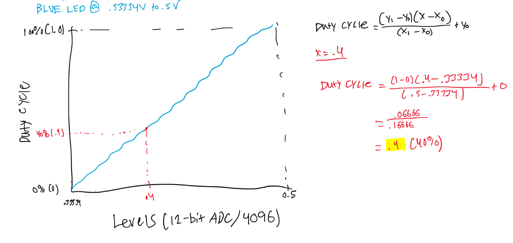

# Lab 9 Spectrum Display

## Overview

Please refer to the following PDF file for detailed instructions and description of the lab:
- [Lab Instructions](Lab_9_Spectrum_Display/images/Lab%209%20-%20Spectrum%20Display.pdf)

## Duty Cycle vs ADC Graph + Equation for Y

We are using 12-bit ADC to determine what part of the rainbow we want to be in. In order to display mixed colors such as yellow or purple, the red, blue, and green leds within the RGB LED require different duty cycles at different values of the ADC that translate to brightness intensity and this brightness intensity of each individual led is what allows the human eye to see these mixed colors.  

Most points of the ADC value will result in the individual leds being either 100% or 0% duty cycle, but in order to represent seamless transition from one color to the next there will be some points where the duty cycle of the individual leds will be linear functions. Thus, I provided a graph depicting one of the points on the spectrum where a linear function is needed for one of the colors and it's properties.

## Video Demo

